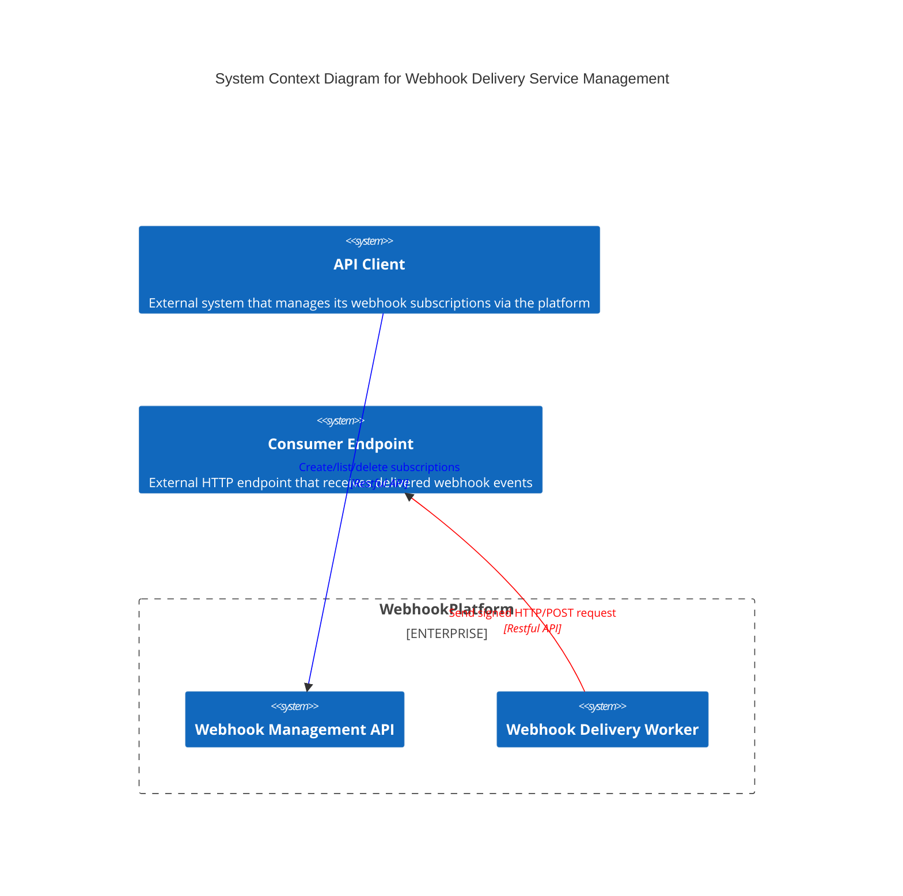
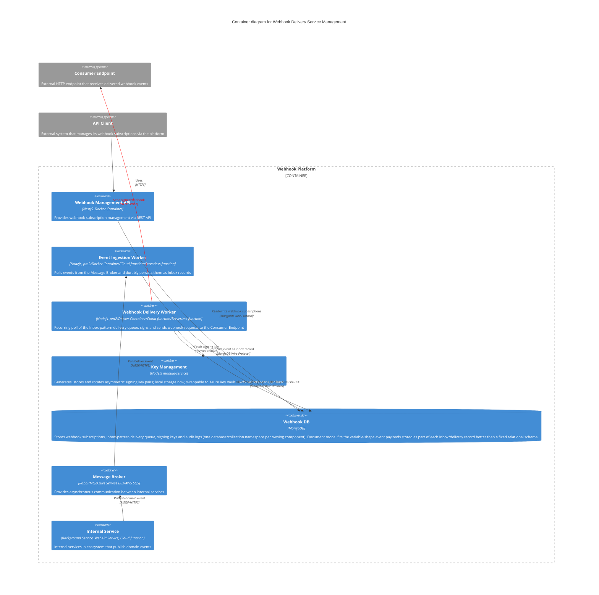
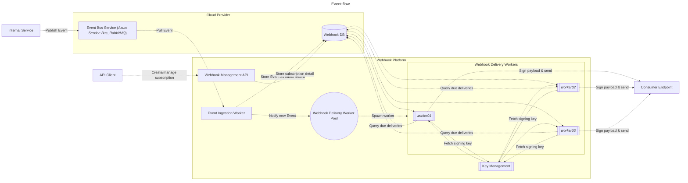

# Architecture

System design for the Webhook Platform: problem statement, event flow, C4 diagrams, design constraints, current
state vs. target state, and lessons learned as the project progresses. For an introduction, feature list, and
local dev instructions, see [`README.md`](README.md) instead — this document is the deep dive, not the entry point.

> **Scope note**: this file covers *system* design — the shape of the platform as a whole. For *code-level*
> implementation conventions (DDD/hexagonal layering, dependency injection, path aliases, per-package tech stack)
> that both human contributors and the AI assistant follow inside a package, see
> [`.agent/rules/architecture.md`](.agent/rules/architecture.md) instead. That file governs how code inside a
> package is written; this one governs how the system as a whole is shaped.

## Problem statement

Internal microservices need a way to notify external clients (API Clients) about domain events in real time,
without every internal service having to build its own subscriber registry, retry logic, and delivery signing.
That's the general "webhook platform" problem — but the harder constraint is durability: the underlying message
broker (RabbitMQ / Azure Service Bus / AWS SQS) guarantees *at-least-once* transport, not delivery outcome
tracking, and cannot be trusted as the system of record for "did subscriber X ever receive event Y."

So the platform has to solve two problems that are easy to get wrong independently:

1. **Never lose an event between "an internal service published it" and "it's durably recorded here."** If the
   worker consuming off the broker goes down, restarts, or the broker redelivers, the event must still end up
   recorded exactly once — not zero times (lost) and not silently duplicated.
2. **Never fail to (eventually) deliver a durably recorded event, and always be able to prove what happened.**
   A subscriber endpoint being down, slow, or flaky is the normal case, not an edge case — delivery must retry,
   track attempt history, and expose delivery/retry status for troubleshooting and manual replay, all while
   guaranteeing the request really came from this platform (asymmetric signing, not a shared secret).

Everything below — the inbox pattern, the "broker is transport only" rule, the durability-in-MongoDB decision, the
signing requirement — follows from those two problems.

## Design constraints

| Constraint | What it means | Why |
| --- | --- | --- |
| **Durability over broker reliance** | Delivery state (audit history, delivery status, retry visibility) lives in MongoDB, not the message broker. The broker is a trigger/transport only, never the source of truth. | Brokers guarantee at-least-once *transport*, not delivery outcome bookkeeping — see [Problem statement](#problem-statement). |
| **Document store over relational** | MongoDB was chosen over the earlier PostgreSQL design specifically because inbox/delivery records embed an arbitrarily-shaped event body payload. | A document maps naturally onto a variable-shape payload; a fixed relational schema would need JSON-column workarounds and a migration per new event shape. |
| **Asymmetric signing, not shared-secret HMAC** | Outgoing webhook requests are signed with RSA/ECDSA, the signature attached as an HTTP header. | A compromised Consumer Endpoint (or a leaked shared secret) can't be used to forge requests as if from the platform; the private key never leaves `key-management`/the delivery worker. |
| **Idempotency everywhere at-least-once applies** | Both event consumption (Event Ingestion Worker) and delivery retries (Webhook Delivery Worker) are idempotent, via the inbox pattern plus dedup keys. | At-least-once delivery from the broker, and retries to subscribers, are both expected — not exceptional — so duplicate processing must be a safe no-op, not a bug class. |
| **Statelessness** | API and worker processes are stateless and horizontally scalable; all durable state lives in the database. | Lets every component scale by adding replicas, and lets any instance crash/restart without losing in-flight work (recoverable from DB state). |

## System boundaries — C4 L1 (System Context)

## Containers — C4 L2

C4 model L3 (Component) and L4 (Code) diagrams are not maintained here — each container has its own documentation
under its package (e.g. `packages/webhook-api/README.md`) covering its API design, sequence diagrams, and a
container diagram scoped to that component.

## Event flow

## Current state (As-Is) vs. target state (To-Be)

| Component | As-Is | To-Be |
| --- | --- | --- |
| `webhook-api` | Built end-to-end on NestJS + MongoDB: domain aggregate, use-cases, Mongoose repository, REST controllers, validation, response envelope. See its own README for full API design. | Swap header-based identity resolution for real Bearer JWT verification (currently a deliberate stand-in — see that package's README). |
| `event-ingestion-worker` | Built end-to-end: `domain/application/infrastructure/runtime` layers, a swappable `BrokerConsumer` port with a RabbitMQ adapter, idempotent Mongo upsert by dedup key, an `EventEnvelopeDto`-validated boundary, and a full unit test suite. See its own README for the full design. | Azure Service Bus / AWS SQS adapters behind the same `BrokerConsumer` port, once a cloud target is chosen (see the Message Broker row below). |
| `webhook-delivery-worker` | Folder + README only — design documented (claim-based polling, signing, retry/backoff, dead-lettering), no code yet. | Full implementation against the `delivery` database, plus integration with `key-management` once that package exists. |
| `key-management` | Not started — referenced in diagrams/design as the future signing-key owner. | A package generating/storing/rotating asymmetric key pairs, local storage first, swappable to Azure Key Vault / AWS Secrets Manager later. |
| Message Broker | Decision pending — see the broker comparison note in `event-ingestion-worker`'s README (RabbitMQ locally; Azure Service Bus or AWS SQS as the likely managed cloud target, chosen per which cloud this ends up deployed to). | A concrete, provisioned broker (local: RabbitMQ via Docker; cloud: managed queue), wired behind the ingestion worker's swappable broker port. |
| Developer Portal (IDP) | Started ahead of the original deferral plan: `packages/idp` is a sandbox API (`POST /sandbox`) that builds, validates, and publishes an event envelope matching `event-ingestion-worker`'s contract onto RabbitMQ — a real trigger through ingestion, confirmed end-to-end. See that package's README for its own Roadmap. | The fuller Developer Portal scope (event type registration, ingestion/delivery visibility, mock Consumer Endpoint) — see the root README's Roadmap section. |

## Lessons learned

This section is a running log — as each core package moves from design to implementation, notable retrospective
notes (what worked, what needed rework, non-obvious pitfalls hit along the way) get added here rather than
scattered across commit messages.

- **Unit tests with mocked collaborators didn't catch a real cross-package contract break — only live end-to-end
  testing did.** `idp`'s publisher and `event-ingestion-worker`'s consumer were each fully unit-tested in
  isolation (mocked `amqp-connection-manager` on both sides) and both suites were green. Only running both
  services against a real RabbitMQ + MongoDB surfaced that `idp`'s applicationName-scoped `eventId` format
  (`OrderService-<uuid>`) failed `event-ingestion-worker`'s `@IsUUID()` validation — a contract mismatch invisible
  to either package's own mocked test suite, since each side's tests only assert against what *that* package
  assumes the other sends. Takeaway: for two packages that agree on a wire contract but never import each other,
  unit tests are necessary but not sufficient — an occasional real integration run against the actual contract is
  what catches drift.
- **`$setOnInsert`, not a plain update, is what makes an idempotent upsert actually idempotent.** A
  `findOneAndUpdate(filter, doc, {upsert:true})` with the full document as the update value does a *replace* on a
  match, not a no-op — a redelivered message would silently overwrite the original record's `receivedAt`/fields.
  Wrapping the write in `$setOnInsert` was necessary to get true "insert if new, otherwise touch nothing"
  semantics — verified against a real MongoDB, not just the mocked repository test, since this is exactly the
  kind of bug a mock keyed on call arguments (not actual document-replacement semantics) can't catch.
- **A third-party library's undocumented-in-types behavior mattered enough to read its source.**
  `amqp-connection-manager`'s `ChannelWrapper.consume()` invokes the `onMessage` callback with no `await`/`.then()`
  (confirmed by reading the compiled source, not just the `.d.ts` signature) — meaning a thrown/rejected handler
  becomes an unhandled rejection, not a caught error, unless the adapter's own callback self-contains every error.
  This shaped the `RabbitMqBrokerConsumerAdapter`'s design (ack/nack driven from inside a try/catch, never
  propagated) and its tests (`vi.waitFor` instead of `await`ing a callback that the library itself never awaits).

## Related

- [`README.md`](README.md) — project introduction, features, how to use, developer guideline.
- [`.agent/rules/architecture.md`](.agent/rules/architecture.md) — code-level implementation conventions (DDD
  layering, DI, path aliases, tech stack) used inside each package.
- [`.agent/rules/deployment.md`](.agent/rules/deployment.md) — per-component CI/deploy rules.
- [`.agent/rules/terminology.md`](.agent/rules/terminology.md) — canonical component naming used throughout this
  document and the codebase.
- Package READMEs: [`webhook-api`](packages/webhook-api/README.md),
  [`event-ingestion-worker`](packages/event-ingestion-worker/README.md),
  [`webhook-delivery-worker`](packages/webhook-delivery-worker/README.md), [`idp`](packages/idp/README.md).
