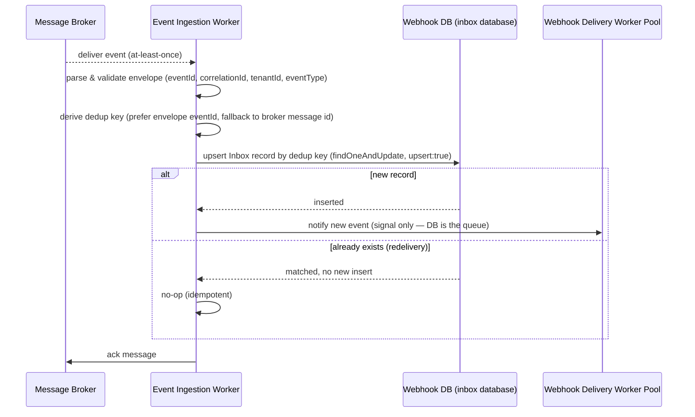
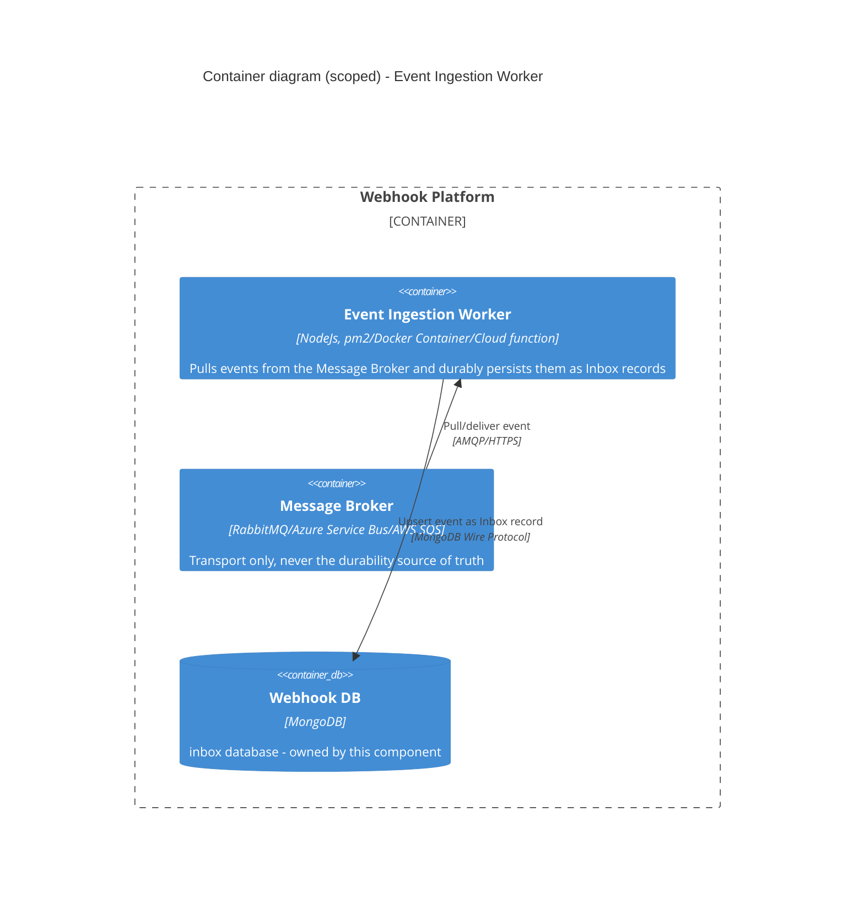

# Event Ingestion Worker

Durable "inbox" for the Webhook Platform — pulls domain events off the Message Broker and persists them as Inbox
records before any delivery attempt happens (see the root [`README.md`](../../README.md) for full system context and
`.agent/rules/terminology.md` for canonical naming).

## Problem statement

Internal services publish domain events onto a Message Broker (RabbitMQ locally; Azure Service Bus or AWS SQS as
the likely managed target in cloud — see the broker comparison note below) that is **not** a durable source of
truth for this platform — brokers are transport only. If the Webhook Delivery Worker pool tried to consume directly
off the broker, any downtime on the worker side would mean events are lost, redelivered with no record, or
acknowledged without ever being delivered — and there would be no way to answer "did subscriber X ever receive
event Y" after the fact.

The Event Ingestion Worker exists to close that gap: it is the **only** component that talks to the Message Broker,
and its single job is to turn "a message arrived on the broker" into "a durable Inbox record exists in MongoDB" —
reliably, exactly-once from the platform's point of view, and fast enough that broker-side redelivery/visibility
timeouts aren't a constant source of duplicate work.

Concretely, it must provide:

- **Audit history** — every event the platform received, regardless of whether a subscriber existed for it yet.
- **Troubleshooting / operational reporting** — "was this event ingested," independent of delivery outcome.
- **Manual replay** — a durable record the Webhook Delivery Worker (or an operator) can re-drive without needing the
  broker to still have the message.
- **Idempotency** — the same broker message (redelivered after a crash, a visibility-timeout expiry, or an
  at-least-once redelivery) must not create two Inbox records.

## Dataflow / architecture



Note the notify step is a hint, not the delivery mechanism — the Webhook Delivery Worker pool's source of truth for
"what's due" is always a poll of the `inbox`/`delivery` collections (inbox pattern), never the broker or this
worker's in-memory state. That's what makes both sides of the pipeline independently restartable.

### Container diagram (scoped to this component)



Not shown here (see root README): the Webhook Delivery Worker pool, Key Management, Webhook Management API — none
are direct dependencies of this container. The Webhook Delivery Worker discovers new Inbox records by polling
`database`, not by talking to this worker.

### Inbox record shape

| Field | Type | Notes |
| --- | --- | --- |
| `id` | `InboxRecordId` (UUIDv7) | this worker's own identity for the record — distinct from `dedupKey` |
| `dedupKey` | `string` | sourced from the envelope's `eventId` (preferred) — falls back to the broker's native message-id property only if a publisher omitted `eventId`. If neither exists, the message is rejected/dead-lettered rather than given a synthetic key: unlike `correlationId`, guessing here risks the exact double-processing this worker exists to prevent. Unique index, drives the idempotent upsert |
| `tenantId` | `TenantId` | which tenant this event belongs to. Sourced from the required [event envelope](#event-envelope-contract)'s `tenantId` field, never derived or inferred here — required so the Webhook Delivery Worker can resolve the right tenant's subscriptions (`webhook-api`'s subscriptions are tenant-scoped), and so the future Developer Portal can scope "show me this tenant's events" queries |
| `correlationId` | `string` | end-to-end trace id for this event's whole journey — sourced from the envelope's `correlationId` field, propagated by the publishing Internal Service through ingestion and delivery to the eventual Consumer Endpoint request, so every log line and DB record for one event can be tied together. **Not** the dedup key — a correlation id may legitimately repeat across related messages (e.g. a saga), unlike `eventId`. If the publisher didn't supply one, this worker generates one at ingestion time and logs a warning — safe here, since a generated fallback only degrades traceability, not correctness |
| `eventType` | `EventType` | sourced from the envelope's `eventType` field, validated against the known event catalog — same value-object shape as `webhook-api`'s `subscribedEventTypes` |
| `payload` | embedded document | the event body as published, stored as-is (arbitrary shape — why MongoDB was chosen, see `architecture.md`) |
| `receivedAt` | `Date` | when this worker ingested it, not when the Internal Service published it |
| `status` | `INGESTED` (single value today) | kept for forward compatibility if this worker ever tracks post-ingestion state itself; delivery status lives entirely on the Webhook Delivery Worker's own `delivery` records, not here |

### Event envelope contract

Every message an Internal Service publishes onto the Message Broker must have this shape as its body — regardless
of which broker carries it:

```json
{
  "eventId": "string",
  "correlationId": "uuid",
  "tenantId": "string",
  "eventType": "string",
  "payload": {}
}
```

| Field | Required | Purpose |
| --- | --- | --- |
| `eventId` | yes | Unique per event occurrence, publisher-assigned — becomes `dedupKey`. Any non-empty string, **not required to be a UUID** — a publisher may scope it (e.g. `OrderService-<uuid>`) for its own traceability. Must **not** be reused across a retried publish of a logically-different event, and must **not** be shared across multiple events the way `correlationId` can be |
| `correlationId` | yes | Trace/grouping id for this event's journey — may repeat across related messages (e.g. steps in one saga); never used for dedup |
| `tenantId` | yes | Which tenant this event belongs to |
| `eventType` | yes | Validated against the known event catalog at ingestion |
| `payload` | yes | The event body itself, arbitrary shape |

**Why a body envelope instead of broker-native metadata** (AMQP `correlation-id` property, Azure Service Bus
`CorrelationId`/`ApplicationProperties`, SQS `MessageAttributes`): broker-native support is inconsistent across
this platform's three target brokers — RabbitMQ and Azure Service Bus have a native correlation-id property, but
**AWS SQS does not** (only a generic attribute bag), and if SQS is fed via an SNS→SQS fan-out, attributes don't
reach SQS at all unless "raw message delivery" is explicitly enabled on the subscription. Even where a native
field exists, nothing enforces that every publishing Internal Service sets it — it's a convention, not a contract.
A required envelope in the message **body** survives every broker/transport hop uniformly and is
schema-validatable at ingestion (reject/dead-letter on a missing required field), keeping this worker's broker
adapter a genuinely thin pull/ack/nack port with no broker-specific metadata-extraction logic per broker.

This doesn't mean broker-native correlation fields go unused — where the broker supports one (RabbitMQ, Azure
Service Bus), this worker still sets it too, as a secondary signal for broker-level tooling and OpenTelemetry's
AMQP auto-instrumentation. The envelope's `correlationId` is simply the **authoritative** source this platform
relies on; the broker-native copy is defense-in-depth, never assumed present on its own.

## Considerations

- **`eventId`, `tenantId`, and `correlationId` are required on every Inbox record, not optional metadata.**
  `eventId` is what makes idempotent dedup actually safe (see below). `tenantId` is what lets the Webhook Delivery
  Worker resolve which tenant's subscriptions care about this event, and what lets the future Developer Portal
  scope per-tenant debugging queries. `correlationId` is what ties one event's ingestion record, delivery
  record(s), and eventual Consumer Endpoint request together across logs and databases — without it, "why didn't
  tenant X receive event Y" has no way to be traced end-to-end. All three are sourced from the publishing Internal
  Service's required [event envelope](#event-envelope-contract) — not broker metadata (see the next bullet,
  "Application-level envelope over broker-native metadata") — and not generated fresh except `correlationId`'s
  logged fallback (see [Inbox record shape](#inbox-record-shape)).
- **Application-level envelope over broker-native metadata.** AWS SQS has no native correlation-id field (only a
  generic attribute bag, and even that doesn't survive an SNS→SQS fan-out unless "raw message delivery" is
  explicitly enabled); RabbitMQ and Azure Service Bus do have native fields, but nothing forces every publisher to
  set them correctly. Requiring `eventId`/`correlationId`/`tenantId`/`eventType` in the message body instead means
  the contract is the same regardless of which broker carries it, and it's schema-validatable at ingestion — see
  [Event envelope contract](#event-envelope-contract).
- **Considered and deferred: an ingestion-confirmation channel back to publishers.** Evaluated an idea mirroring
  RabbitMQ's publisher-confirms — this worker reverting an ingestion result back to the publishing Internal
  Service — and dropped it: internal publishers don't need synchronous "did you ingest my event" feedback today.
  Revisit only if an internal service later needs one, most likely by reusing the Webhook Delivery Worker's
  existing delivery mechanism for internal services too, rather than building a second one-off channel.

- **Broker choice is swappable by design.** `.agent/rules/terminology.md` defines the Message Broker as
  RabbitMQ/Azure Service Bus/AWS SQS interchangeably — transport only. Local dev should target RabbitMQ (matches
  the docker-compose footprint of the rest of the stack); the cloud target should be the managed queue native to
  whichever cloud this is deployed to (Azure Service Bus on Azure, SQS on AWS) rather than self-hosting RabbitMQ in
  production, so the broker adapter behind this worker's `infrastructure/` layer must stay a thin, swappable port —
  never leak broker-specific types into `domain/`/`application/`.
- **Idempotent ingestion, not idempotent delivery.** This worker only guarantees a message is durably recorded
  once; it says nothing about whether the Webhook Delivery Worker successfully delivers it — that's a separate
  idempotency concern owned by that package.
- **Dedup key choice matters.** Prefer the envelope's `eventId` over the broker's own message id, and never use
  `correlationId` or a content hash. Broker message ids only dedup broker-level redelivery of the *same* message —
  a publisher retrying a failed publish produces a *new* broker message id for the same logical event, so a
  publisher-assigned `eventId` is what actually captures "this is the same event occurrence." A content hash
  breaks for events that are legitimately identical in payload but distinct occurrences (e.g. two `order.created`
  events with coincidentally identical bodies). If neither `eventId` nor a broker message id is present, the
  message is rejected/dead-lettered — synthesizing a key here would risk silent duplicate processing, the exact
  failure this worker exists to prevent.
- **Ack after persist, not before.** The message is only acked to the broker once the Inbox upsert has been
  confirmed by MongoDB — acking first and persisting after reintroduces the exact loss window this worker exists to
  close.
- **No business/delivery logic here.** This worker does not know about subscriptions, signing, or Consumer
  Endpoints — it stores the event body as-is (hence MongoDB's document model, per `.agent/rules/architecture.md`)
  and stops. Fan-out to subscribers is entirely the Webhook Delivery Worker's concern, discovered by that worker's
  own query against `inbox`/subscription data, not pushed by this one.

## Scalability strategy

- **Stateless, horizontally scalable consumers.** Multiple instances of this worker can run as a competing-consumer
  group against the same broker queue/topic — the broker's own delivery semantics (not in-process state) handle
  distributing messages across instances, so scaling out is just adding replicas.
- **Idempotent upsert absorbs duplicate work from scaling.** Because ingestion is keyed on dedup key, two instances
  racing to ingest the same redelivered message converge on one Inbox record rather than requiring distributed
  locking.
- **Batch pulls where the broker supports it** (e.g. SQS `ReceiveMessage` with a batch size, RabbitMQ prefetch) to
  amortize round-trips, with backpressure — don't pull more than the worker can persist within the broker's
  visibility/lock timeout, or messages will be redelivered before they're even acked.
- **Autoscale on broker lag**, not CPU — queue depth / age-of-oldest-message is the signal that actually indicates
  this worker is falling behind, since the work itself (one upsert per message) is cheap and I/O-bound.
- **MongoDB write path**: `inbox` collection indexed on the dedup key (unique index) so the upsert is a single
  indexed write, not a collection scan, even as the worker fleet and event volume grow. A secondary compound index
  on `(tenantId, receivedAt)` — and one on `correlationId` — is needed too, not for the write path itself but for
  the read patterns those fields exist to serve (Webhook Delivery Worker's per-tenant lookups, the future Developer
  Portal's "show this tenant's/this correlation's events" debugging queries) — without it those become collection
  scans as the `inbox` collection grows.

## Availability strategy

- **No single point of failure in the worker fleet.** Run ≥2 replicas across availability zones; the broker's
  competing-consumer distribution means losing one instance just redistributes its share of messages to the
  survivors, with at-least-once redelivery of whatever it hadn't acked yet.
- **Broker-side durability/HA is a prerequisite, not this worker's job**: mirrored/quorum queues (RabbitMQ) or the
  managed service's built-in redundancy (Azure Service Bus / SQS) — this worker assumes the broker itself won't
  silently drop a message, only that redelivery is possible.
- **MongoDB replica set** for the `inbox` database, so a primary failover doesn't lose an in-flight upsert — the
  driver's retryable writes handle the failover window transparently.
- **Poison-message handling**: after N failed persist attempts for the same message, route to a dead-letter
  queue/topic instead of retrying forever — an unpersistable message (e.g. malformed payload) should not block the
  queue for every other event behind it.
- **Graceful shutdown**: on `SIGTERM`, stop pulling new messages, finish in-flight upserts, then exit — avoids
  acking a message whose upsert never completed during a rolling deploy.
- **Health/liveness checks** exposed for the orchestrator (pm2/Docker/k8s), per `.agent/rules/deployment.md`'s
  "thin, swappable runtime entrypoint" rule — the entrypoint only wires triggering + health reporting to the
  application-layer use case; no business logic lives there.

## Related

- Root [`README.md`](../../README.md) — full event-flow diagram and C4 L1/L2 for the whole platform.
- `.agent/rules/architecture.md` — repo shape, layering, and the `inbox` database ownership rule.
- `.agent/rules/deployment.md` — per-component Dockerfile/deploy pipeline, independent from `webhook-delivery-worker`.
- `.agent/rules/terminology.md` — canonical naming (this package is `event-ingestion-worker`, not "event consumer
  worker" or "Delivery Manager").
- [`../webhook-delivery-worker/README.md`](../webhook-delivery-worker/README.md) — the downstream consumer of the
  Inbox records this worker creates.
