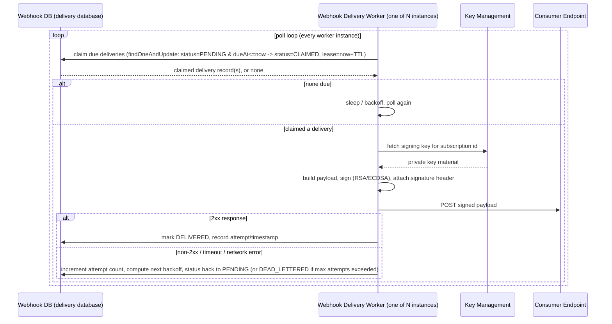
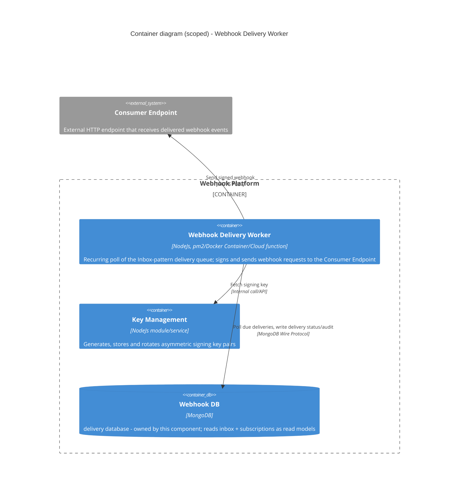

# Webhook Delivery Worker

The delivery-side worker pool for the Webhook Platform — polls the Inbox-pattern delivery queue, signs each payload,
and POSTs it to the subscriber's Consumer Endpoint (see the root [`README.md`](../../README.md) for full system
context).

> **Naming note**: canonical name is `webhook-delivery-worker` per `.agent/rules/terminology.md`, which explicitly
> retires "Webhook Delivery Manager" / "Webhook Worker Pool" / `worker01-03` as ambiguous old names — a component
> called "Delivery Manager" that never delivered anything caused real confusion before. This README uses **Webhook
> Delivery Worker** (singular component; multiple horizontally-scaled instances) throughout.

## Problem statement

Once the Event Ingestion Worker has durably recorded an event as an Inbox record, something has to actually deliver
it to every subscriber interested in that event type — reliably, exactly-once from the subscriber's point of view
(as much as an at-least-once system can guarantee), with the delivery cryptographically signed so the Consumer
Endpoint can verify it really came from this platform.

That "something" must survive the failure modes a webhook system runs into constantly in production:

- The Consumer Endpoint is down, slow, or returns 5xx — delivery must be retried, not dropped.
- The same event/subscription pair must never be delivered twice as a genuinely new delivery if a retry is really
  just the previous attempt being re-driven (idempotency, not just "retry until success").
- Operators need **delivery status and retry visibility** per event/subscriber pair — "did subscriber X get event
  Y, how many attempts, what was the last error" — not just fire-and-forget.
- Signing must use **asymmetric cryptography (RSA/ECDSA)**, attached as a request header — never a shared-secret
  HMAC, per the platform's stated security practice.
- The worker pool must be **stateless and horizontally scalable** — no in-memory queue, no sticky routing of a
  given delivery to a specific worker instance.

## Dataflow / architecture

The `delivery` collection **is** the queue (inbox/outbox-style pattern) — workers never coordinate with each other
directly, only through atomic claim operations against MongoDB. This is what lets the pool scale to N instances
with zero shared in-memory state.

### Container diagram (scoped to this component)

Not shown here (see root README): the Event Ingestion Worker, Webhook Management API, Message Broker — none are
direct dependencies of this container. This worker never talks to the broker; it only ever reads from MongoDB.

## Considerations

- **Poll, don't subscribe to a push signal.** Even though `event-ingestion-worker` may emit a "new event" notify
  hint, this worker's correctness must never depend on receiving it — a missed/lost notification must not mean a
  missed delivery. The poll loop against `dueAt<=now` is the only source of truth for what's due.
- **Claim, don't just read-then-write.** A plain "read due deliveries, then process" invites two worker instances
  processing (and double-delivering) the same record. Claiming via an atomic `findOneAndUpdate` with a status
  transition + lease/TTL field is what makes concurrent polling by N workers safe without external locking.
- **Idempotency has two layers**: (1) this worker's own retry-vs-new-delivery distinction (a retried attempt
  updates the existing delivery record's attempt count, it never creates a second delivery record for the same
  event/subscription pair), and (2) giving the Consumer Endpoint an idempotency key (e.g. delivery id) in the
  request so *their* at-least-once handling is also safe — this platform can only control its own send side.
- **Re-check SSRF/target validity at send time, not just at subscription-creation time.** `webhook-api`'s
  `TargetUrl` validation is a static check on subscription create/update and explicitly does not defend against DNS
  rebinding (see that package's README) — this worker is the one actually opening the connection, so the
  resolve-then-check-IP + redirect-limiting defense belongs here.
- **Signing key handling stays entirely inside Key Management.** This worker fetches key material at send time only
  — it must never persist private key material itself, log it, or cache it longer than a single delivery attempt
  needs.
- **Backoff must be bounded.** Unbounded retry against a permanently-dead Consumer Endpoint wastes worker capacity
  and can look like the platform is hammering a dead host. Exponential backoff with jitter, a max attempt count,
  and a terminal `DEAD_LETTERED` status (surfaced for manual replay) close the loop.

## Scalability strategy

- **Stateless worker pool, scale by replica count.** Every instance runs the identical poll/claim/sign/send loop;
  throughput scales close to linearly with instance count until the `delivery` collection's claim query becomes the
  bottleneck.
- **Claim query must stay indexed.** `{status, dueAt}` (and ideally a tenant/shard key) needs a compound index so
  the claim `findOneAndUpdate` is a targeted index scan even as the collection grows into millions of delivery
  records.
- **Partition claim contention, not just add replicas.** At high concurrency, N workers all racing the same
  `{status: PENDING, dueAt: {$lte: now}}` query causes write contention on the same hot documents. Bucketing due
  deliveries (e.g. by a hash of subscription id into a fixed number of partitions, one or few workers per partition)
  avoids workers repeatedly losing claim races against each other as the fleet grows.
- **Autoscale on due-delivery backlog** (count of `PENDING` records past `dueAt`, or oldest-`dueAt` age) — the same
  "lag" signal used for the Event Ingestion Worker, not CPU, since the work is I/O-bound (outbound HTTP + a DB
  write per attempt).
- **Per-endpoint concurrency limiting.** A single slow-but-technically-up Consumer Endpoint shouldn't let every
  worker pile concurrent requests onto it — cap in-flight requests per endpoint so one bad subscriber can't starve
  the pool's capacity for delivering to everyone else.

## Availability strategy

- **No single point of failure in the pool.** Run ≥2 replicas across availability zones (`worker01`/`worker02`/
  `worker03` in the old naming, now just "N instances of `webhook-delivery-worker`") — losing an instance mid-claim
  is recoverable because of the lease/TTL mechanism below, not because any one instance is special.
- **Lease TTL releases orphaned claims.** If a worker crashes after claiming a delivery but before completing it,
  the claim's lease expires and another instance's poll picks it back up — this is what keeps a crash from
  silently stalling that delivery forever, without needing a separate reconciliation job for the common case.
- **MongoDB replica set** for the `delivery` database, so a primary failover mid-claim doesn't lose delivery status
  — retryable writes handle the failover window; the claim's own idempotent state-transition design also tolerates
  a write being safely retried after a failover.
- **Circuit breaking per Consumer Endpoint.** After repeated consecutive failures to one endpoint, back off sending
  to it (short cooldown before retrying) rather than continuing to dispatch workers at a host that's clearly down —
  protects worker capacity for endpoints that are actually reachable.
- **Dead-letter + manual replay, not infinite retry.** A permanently failing delivery terminates into
  `DEAD_LETTERED` with full attempt history preserved (audit requirement from the problem statement) instead of
  either retrying forever or silently dropping — an operator (or an automated replay tool) can re-drive it later.
- **Graceful shutdown**: on `SIGTERM`, stop claiming new deliveries, let in-flight sends finish (or let their lease
  expire cleanly if they can't finish in time), then exit — per `.agent/rules/deployment.md`'s thin runtime-entrypoint
  rule, this belongs in the swappable pm2/Docker/cloud-function entrypoint, not the application-layer use case.

## Related

- Root [`README.md`](../../README.md) — full event-flow diagram and C4 L1/L2 for the whole platform.
- `.agent/rules/architecture.md` — repo shape, layering, and the `delivery` database ownership rule.
- `.agent/rules/deployment.md` — per-component Dockerfile/deploy pipeline, independent from `event-ingestion-worker`.
- `.agent/rules/terminology.md` — canonical naming (this package is `webhook-delivery-worker`).
- [`../webhook-api/README.md`](../webhook-api/README.md) — owns subscription data this worker reads (target URL,
  event types, status) but never writes.
- [`../event-ingestion-worker/README.md`](../event-ingestion-worker/README.md) — upstream producer of the Inbox
  records this worker's deliveries are derived from.
